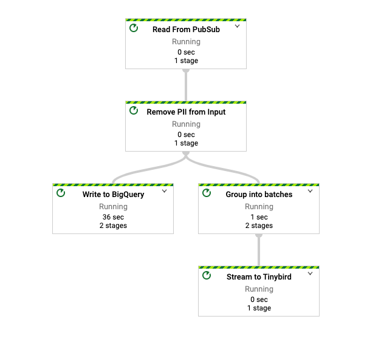

# tinybird-beam

A Tinybird Apache Beam connector to ingest from an Apache Beam pipeline running in DataFlow, Flink or Spark to a [Tinybird](https://www.tinybird.co/) Data Source

Directories:

- `tinybird`: Contains the source code for the Apache Beam connector
- `dataflow`: Pipeline definition to stream data from Google PubSub to Tinybird using the Apache Beam connector

## Installation

Install the `tinybird-beam` [PyPI package](https://pypi.org/project/tinybird-beam/) in your Python project. See the `dataflow` directory for a usage example.

```sh
pip install tinybird-beam
```

## How to use it

```python
# Import the sink class
from tinybird.beam import WriteToTinybird

# pipe a PCollection with elements of type `Iterable[Dict[str, Any]]` to the sink class
# you should batch your elements beforehand using a `beam.WindowInto` or `beam.transforms.util.GroupIntoBatches`
host = 'https://api.tinybird.co'
token = '' # get it from https://ui.tinybird.co/tokens
datasource = '' # name of the Data Source
columns = '' # comma separated list with the name of the columns of the Data Source
out | "Stream to Tinybird" >> WriteToTinybird(host, token, datasource, columns)
```

## Development

```sh
python3 -m venv env
source env/bin/activate
pip install -e .
```

## DataFlow example

The `dataflow` directory contains some sample code to deploy to DataFlow an Apache Beam pipeline that gets data from a PubSub topic and ingests to a BigQuery table and a Tinybird Data Source.

Follow these steps to run the example:

### Prepare the environment

- Push this Data Source to your Tinybird account and name it `pubsub__invoices`:

```
SCHEMA >
    `id` UInt32,
    `agent_id` UInt8,
    `recipient_code` UInt32,
    `client_id` UInt32,
    `amount` Float32,
    `currency` LowCardinality(String),
    `created_at` DateTime,
    `added_payments` String
```

- Create the Python environment:

```sh
cd dataflow
python3 -m venv env
source env/bin/activate
pip install -r requirements.txt
# Update the variables in the `sample.env` file and source it:
source sample.env
```

- Create the PubSub topic:

```sh
gcloud pubsub topics create demo-topic
```

- Import the `dataflow/pubsub/invoices_sample.json` file to BigQuery. We use as `dataset.table_name` -> `tinybird.pubsub__invoices`.

### Run the example

- Push the Apache Beam pipeline to DataFlow:

```sh
python dataflow.py \
  --project=$PROJECT_NAME \
  --region=$REGION \
  --runner=DataflowRunner \
  --temp_location=$TMP_LOCATION \
  --input_topic=projects/$PROJECT_NAME/topics/$TOPIC \
  --bq_table=tinybird.pubsub__invoices \
  --batch_size=10000 \
  --batch_seconds=30 \
  --batch_key= \
  --tb_host=https://api.tinybird.co \
  --tb_token=$TB_TOKEN \
  --tb_datasource=pubsub__invoices \
  --tb_columns="id,agent_id,recipient_code,client_id,amount,currency,created_at,added_payments"
```

This pipeline will batch 10000 elements or a window of 30 seconds to the Tinybird Data Source.

Once running you'll see this log (it might take several minutes to deploy):

```sh
INFO:apache_beam.runners.dataflow.dataflow_runner:Job 2021-01-22_08_13_37-6419261550197294468 is in state JOB_STATE_RUNNING
INFO:apache_beam.runners.dataflow.dataflow_runner:2021-01-22T16:13:48.981Z: JOB_MESSAGE_DETAILED: Pub/Sub resources set up for topic 'projects/---/topics/demo-topic'.
INFO:apache_beam.runners.dataflow.dataflow_runner:2021-01-22T16:13:50.023Z: JOB_MESSAGE_DEBUG: Starting worker pool setup.
INFO:apache_beam.runners.dataflow.dataflow_runner:2021-01-22T16:13:50.034Z: JOB_MESSAGE_BASIC: Starting 1 workers in europe-west3-b...
INFO:apache_beam.runners.dataflow.dataflow_runner:2021-01-22T16:13:50.048Z: JOB_MESSAGE_DEBUG: Starting worker pool setup.
INFO:apache_beam.runners.dataflow.dataflow_runner:2021-01-22T16:14:17.581Z: JOB_MESSAGE_DETAILED: Autoscaling: Raised the number of workers to 1 so that the pipeline can catch up with its backlog and keep up with its input rate.
INFO:apache_beam.runners.dataflow.dataflow_runner:2021-01-22T16:15:02.264Z: JOB_MESSAGE_DETAILED: Workers have started successfully.
INFO:apache_beam.runners.dataflow.dataflow_runner:2021-01-22T16:15:02.278Z: JOB_MESSAGE_DETAILED: Workers have started successfully.
```

- Start the PubSub publisher:

```
cd pubsub
python pubsub.py
```

After the pipeline is deployed [the job](https://console.cloud.google.com/dataflow/jobs) would look like this:



Once it starts receiving data, you can check the data in your BigQuery table and Tinybird Data Source.

### Clean resources

Stop the DataFlow pipeline from the [Google Cloud console](https://console.cloud.google.com/dataflow/jobs).

Clean up the PubSub topic.

```sh
gcloud pubsub topics delete demo-topic
```
